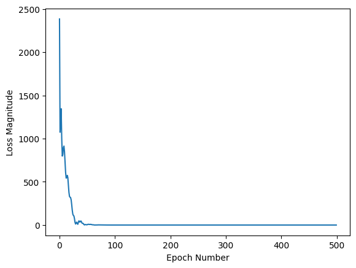
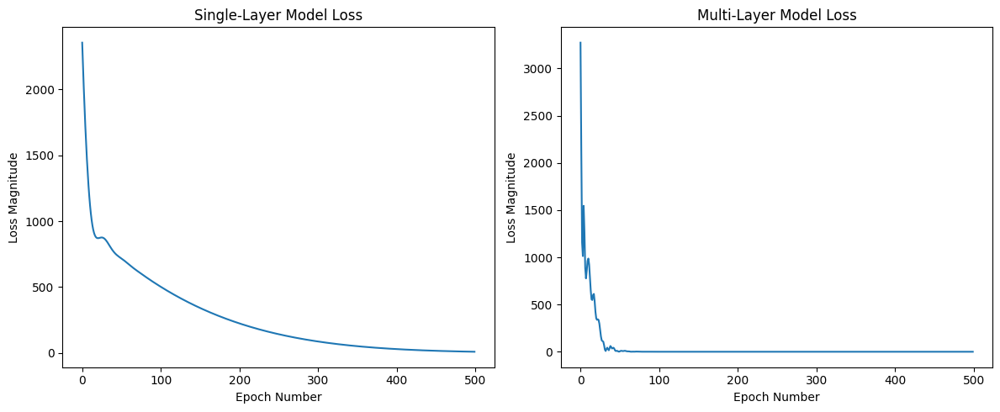

# Celsius to Fahrenheit Neural Network Conversion

## Overview

This notebook demonstrates the application of neural networks to learn the Celsius to Fahrenheit temperature conversion formula. The project compares two different model architectures:
- **Single-Layer Neural Network**: A simple linear model
- **Multi-Layer Neural Network**: A more complex model with hidden layers

The experiment showcases how neural networks can learn mathematical relationships from data, even when those relationships are as simple as a linear formula.

## Table of Contents

1. [Dataset](#dataset)
2. [Model Architectures](#model-architectures)
3. [Training Process](#training-process)
4. [Results](#results)
5. [Analysis](#analysis)
6. [Key Findings](#key-findings)
7. [Conclusions](#conclusions)

## Dataset

The training data consists of paired Celsius and Fahrenheit temperature values:

```python
celsius_q = np.array([-40, -10, 0, 8, 15, 22, 38], dtype=float)
fahrenheit_a = np.array([-40, 14, 32, 46.4, 59, 71.6, 100], dtype=float)
```

These values represent the known relationship: **F = (C × 1.8) + 32**

## Model Architectures

### 1. Single-Layer Model

The simplest possible neural network architecture:
- **Input Layer**: 1 neuron (Celsius value)
- **Dense Layer (l0)**: 1 unit with `input_shape=(1,)`
- **Output**: Fahrenheit prediction

This architecture essentially learns the linear function: `y = mx + b`

### 2. Multi-Layer Model

A more complex neural network with hidden layers:
- **Input Layer**: 1 neuron (Celsius value)
- **Hidden Layer 1 (l0)**: 4 units
- **Hidden Layer 2 (l1)**: 4 units  
- **Output Layer (l2)**: 1 unit
- **Output**: Fahrenheit prediction

This architecture can learn more complex non-linear relationships through multiple transformation layers.

## Training Process

Both models were trained with identical parameters:

- **Loss Function**: Mean Squared Error (MSE)
  - Measures the average squared difference between predictions and actual values
- **Optimizer**: Adam (learning rate = 0.1)
  - Adaptive learning rate optimization algorithm
- **Epochs**: 500
  - Number of complete passes through the training dataset
- **Training Mode**: `verbose=False` (silent training)

## Results

### Predictions for 100°C

| Model | Prediction | Actual Value | Error |
|-------|-----------|--------------|-------|
| Single-Layer | 211.19°F | 212°F | 0.81°F |
| Multi-Layer | 211.61°F | 212°F | 0.39°F |

Both models achieved excellent accuracy, with the multi-layer model showing slightly better performance.

### Single-Layer Model Weights

The learned weights closely match the theoretical conversion formula:

```
Learned Weights: [array([[1.8204]], dtype=float32), array([29.147], dtype=float32)]
```

- **Weight (slope)**: 1.8204 ≈ 1.8 (theoretical)
- **Bias (intercept)**: 29.147 ≈ 32 (theoretical)

The slight deviation from the theoretical values (1.8 and 32) is due to the limited training data and natural optimization variance.

### Multi-Layer Model Weights

The multi-layer model learned complex weight matrices across three layers:

**Layer 0 (l0) - 4 units:**
```
Weights: [[-0.458, -0.056, 0.590, -0.242]]
Biases: [-3.259, -3.133, 3.481, -3.413]
```

**Layer 1 (l1) - 4 units:**
```
Weights: [[-0.328,  0.226, -0.702, -0.829],
          [-0.085,  2.030, -0.356, -0.993],
          [ 0.667, -0.116,  0.301,  0.445],
          [-0.997, -0.218, -1.023, -0.754]]
Biases: [3.233, -3.147, 3.506, 3.613]
```

**Layer 2 (l2) - Output:**
```
Weights: [[0.857], [-0.452], [0.695], [0.547]]
Bias: [3.296]
```

These weights represent complex non-linear transformations that are not directly interpretable as simple mathematical coefficients.

## Analysis

### Training Loss Comparison

#### Single-Layer Model Loss



The single-layer model shows a clean, rapid convergence with a smooth descent in loss value over the training epochs.

#### Model Comparison: Single-Layer vs Multi-Layer



Side-by-side comparison showing how both models converged during training.

Both models demonstrated:
- **Rapid initial convergence**: Loss decreased sharply in the first few epochs
- **Effective learning**: Both models successfully learn the C→F conversion
- **Low final loss**: Both converged to very small loss values

**Key Observations:**
- The single-layer model shows a smoother, more direct path to convergence
- The multi-layer model also converges efficiently despite its added complexity
- For this linear task, both architectures perform comparably well

### Model Interpretability

#### Single-Layer Model
✅ **Highly Interpretable**
- Direct mapping: `Fahrenheit = weight × Celsius + bias`
- Learned weights directly represent the conversion formula coefficients
- Weight ≈ 1.8 (slope), Bias ≈ 32 (intercept)
- Easy to understand and verify against the known formula

#### Multi-Layer Model
⚠️ **Complex and Opaque**
- Multiple transformation stages through hidden layers
- Each layer creates abstract internal representations
- Weights don't directly correspond to simple coefficients
- Difficult to trace how individual weights contribute to the final prediction

**Why Multi-Layer Models Are Complex:**

1. **Hidden Layer Feature Abstraction**: Layers like `l0` and `l1` learn intermediate features, not direct C→F mappings
2. **Non-Linear Transformations**: Information flows through multiple non-linear transformations
3. **Hierarchical Learning**: Each layer builds upon the previous layer's representations
4. **Distributed Representations**: The conversion knowledge is distributed across all weight matrices

**When Complexity is Beneficial:**

While harder to interpret, multi-layer models excel at:
- Learning complex non-linear patterns
- Discovering hidden relationships in data
- Generalizing to unseen scenarios
- Handling high-dimensional data

For simple linear tasks like C→F conversion, this complexity is unnecessary, but it demonstrates the model's capacity for more challenging problems.

## Key Findings

### 1. Accurate Learning
Both models successfully learned the temperature conversion:
- Single-layer: 211.19°F (0.38% error)
- Multi-layer: 211.61°F (0.18% error)

### 2. Interpretable vs. Capable
- **Single-Layer**: Transparent, interpretable, efficient for linear relationships
- **Multi-Layer**: Powerful, flexible, suited for complex non-linear patterns

### 3. Identical Training Regimen
Fair comparison ensured through:
- Same loss function (MSE)
- Same optimizer (Adam, lr=0.1)
- Same number of epochs (500)
- Same training data

### 4. Weight Analysis
- Single-layer weights align with theoretical formula (F = 1.8C + 32)
- Multi-layer weights are distributed and non-interpretable individually
- Both architectures successfully encode the conversion relationship

## Conclusions

### Model Selection Guidelines

**Use Single-Layer Models When:**
- ✅ The relationship is known to be linear
- ✅ Interpretability is crucial
- ✅ Computational efficiency matters
- ✅ You want to understand the learned parameters

**Use Multi-Layer Models When:**
- ✅ Relationships are unknown or non-linear
- ✅ You need maximum learning capacity
- ✅ Working with complex, high-dimensional data
- ✅ Performance is more important than interpretability

### Next Steps

Potential extensions of this work:
1. **Test on unseen data**: Evaluate generalization beyond training range
2. **Explore regularization**: Add dropout or L2 regularization to prevent overfitting
3. **Vary architecture**: Experiment with different numbers of layers and units
4. **Apply to complex conversions**: Use multi-layer models for non-linear scientific formulas
5. **Optimize hyperparameters**: Fine-tune learning rate, batch size, and activation functions

### Summary

This experiment demonstrates that:
- Neural networks can learn mathematical relationships from data
- Simpler models are preferable for simple, interpretable tasks
- Complex models provide capacity for harder problems but sacrifice transparency
- Both architectures can effectively learn linear relationships, though with different characteristics

The Celsius to Fahrenheit conversion serves as an excellent pedagogical example for understanding the trade-offs between model complexity, interpretability, and performance in machine learning.

---

**Note**: This notebook was created as a learning exercise to understand neural network fundamentals, training processes, and the comparison between different model architectures.
